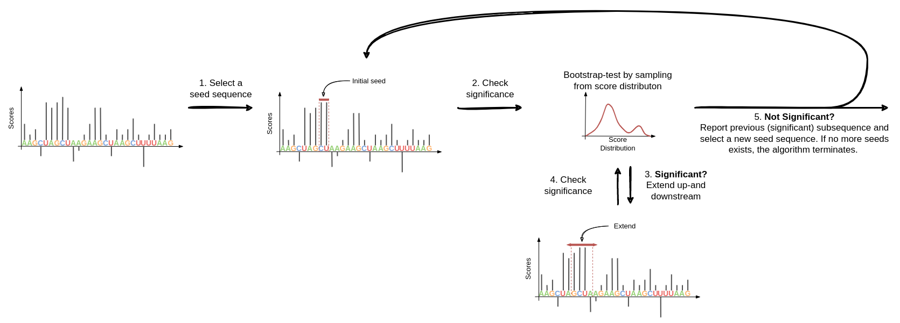

# Metamotif

Metamotif is a tool for extracting informative subsequences from a set of sequences with corresponding postion-wise importance scores. Metamotif strives to be simple, easy to use and robust towards hyperparameters. 

## :computer: Installation

To install the latest stabel version, run the following command:

`pip install git+https://github.com/mhorlacher/metamotif.git`

To install a specific version (e.g. `0.4.0`), run this command:

`pip install git+https://github.com/mhorlacher/metamotif.git@0.4.0`

&nbsp;
&nbsp;

## Searching for subsequences

The search for informative subsequences is invoked via `metamotif search`, which takes as input

1) a list of sequences in FASTA format
2) a numpy array of shape (n_sequences, len_sequences). (Note that variable-length sequences are currently not supported.)

An example is given below. 

`metamotif search examples/example.QKI/QKI_HepG2.fasta examples/example.QKI/QKI_HepG2.scores.npy -o QKI.kmers.tsv`

Identified subsequences are written to a TSV line-by-line. See [QKI.kmers.tsv](examples/example.QKI/QKI.kmers.tsv) for an example. 

### Customizing `metamotif search`

`metamotif search` exposes a number of hyperparameters that can be specified to tune the search processes for a specific task. 
Hyperparameters may be specified by a `config.gin` file, which is provided via `metamotif search --config config.gin`. 
See the [default-search.config.gin](configs/default-search.config.gin) for an example. 

The following hyperparameters may be specified:

- search.seed_size: Size of the initial seed sequence (default = 2). 
- search.max_size: Maximum size of the extracted subsequences (default = 20). 
- search.sig_p: Significance threshold for subsequences (default = 0.01). 
- search.extend_flanks: Size by which significant subsequences are extended up-and downstream (default = 0). 

&nbsp;
&nbsp;

## :test_tube: How it works

Put simply, for a given sequence with corresponding importance scores, `metamotif search` identifies subsequences which are significantly more informative that one would expect by chance. To this end, the algorithms starts with a short subsequence (default search.seed_size = 2) and iteratively extends it until its cumulative importance becomes non-significant. 
The process continues until all significant informative subsequences of maximum length are identified. 
This way, `metamotif search` can identify a variable number of subsequences with variable length. 

--- 

:warning: Metamotif is under active developement and its API might change at any time. 
